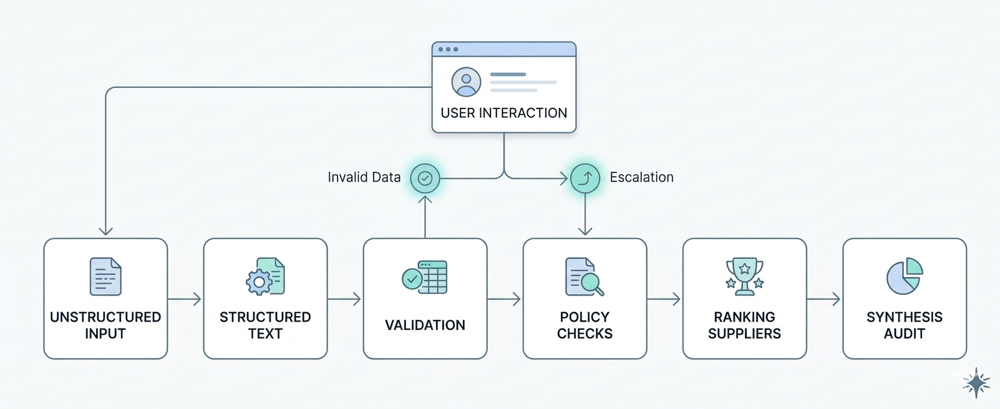

# ChainIQ Sourcing Intelligence — StartHack 2026

Audit-ready autonomous sourcing agent built for ChainIQ's procurement challenge at StartHack 2026 (St. Gallen, March 19–21).

The system operates across a simulated global enterprise procurement environment spanning **19 countries**, **3 currencies** (EUR, CHF, USD), and **4 procurement categories** (IT, Facilities, Professional Services, Marketing).

## What it does

Converts unstructured purchase requests into structured, defensible supplier comparisons — fully automated, with human-in-the-loop escalation handling.

**Example input:** _"Need 500 laptops in 2 weeks, prefer Supplier X, budget 400k."_

The agent:
1. **Parses** free-text requests via LLM into structured fields (quantity, category, budget, delivery constraints, etc.)
2. **Validates** completeness — detects missing fields, contradictions, and implausible values
3. **Applies procurement policies** — approval thresholds (AT rules), category rules (CR), geography rules (GR), escalation rules (ER), preferred/restricted supplier lists
4. **Filters and ranks suppliers** deterministically via a 3-phase engine (parse → filter → score/rank)
5. **Presents results in chat** — ranked supplier comparison, escalation actions, and follow-up Q&A in a ChatGPT-style interface
6. **Resolves escalations inline** — "Ask the Client" for missing info, "Request Approval" for internal sign-offs, with automatic policy rechecks after every update
7. **Generates a purchase order** when no blocking escalations remain

Every decision is traceable: the output includes a full audit trail of policies checked, suppliers evaluated, and data sources used.

## Architecture



**Flow summary:**

1. **Unstructured Input** — Free-text procurement request from the user
2. **Structured Text** — LLM parses input into `request_json`
3. **Validation** — Structural + semantic checks; if invalid data → loops back to **User Interaction** to clarify
4. **Policy Checks** — Filters by category, geo, capacity, budget, lead time; escalations → routed to **User Interaction** for resolution
5. **Ranking Suppliers** — Scores and ranks by quality, risk, ESG, price
6. **Synthesis Audit** — Produces ranked shortlist, policies, and full audit trail


## Tech Stack

| Layer | Technology |
|-------|------------|
| Backend | FastAPI (Python 3.13) + Uvicorn |
| LLM | Groq API — `qwen/qwen3-32b` |
| Frontend | Single-page HTML + Tailwind CSS (CDN) + vanilla JS |
| Data | CSV/JSON files (no database) |

## Setup

```bash
python -m venv .venv
source .venv/bin/activate
pip install -r requirements.txt
```

Create a `.env` file in the project root:

```
GROQ_API_KEY=your_groq_api_key_here
```

Run the server:

```bash
uvicorn app:app --reload
```

Open [http://localhost:8000](http://localhost:8000). Append `?dev=true` to the URL to enable the developer panel (parsed JSON, output JSON, provenance).

## UI Flow

1. **Initial screen** — centered hero with chat input bar. Type or paste a purchase request
2. **Parsing & validation** — the request is parsed into structured fields. If required fields are missing (quantity, category, delivery country), the agent asks the client to provide them via chat
3. **Processing** — the 3-phase engine filters suppliers by category, geography, capacity, budget, and lead time, then scores and ranks the remaining candidates
4. **Results in chat** — the LLM summarizes the recommendation as chat messages, with suggestion chips for quick follow-ups
5. **Dashboard** — click "Open Dashboard" to reveal a side panel with the full Request Summary: actions required, current supplier choice, comparison table, alternatives, and excluded suppliers
6. **Escalation resolution** — blocking escalations (restricted supplier, budget threshold, insufficient quotes) show action buttons. "Ask the Client" simulates a client response; "Request Approval" simulates internal sign-off. Policy is automatically rechecked after each resolution
7. **Approve & Create PO** — when all blocking escalations are resolved, the forward button creates the purchase order

## Data Files

All source data lives in `data/`:

| File | Records | Description |
|------|---------|-------------|
| `suppliers.csv` | 151 | Supplier master data — quality, risk, ESG scores, preferred/restricted flags, service regions, capacity |
| `pricing.csv` | 599 | Volume-tiered pricing — unit prices, MOQ, standard & expedited lead times |
| `policies.json` | — | Procurement rules: approval thresholds (AT-001–015), escalation rules (ER-001–008), category rules (CR-001–010), geography rules (GR-001–008) |
| `requests.json` | — | Sample purchase requests with scenario tags (standard, missing_info, contradictory, threshold_exceeded, restricted_supplier) |
| `historical_awards.csv` | 590 | Past award decisions — savings %, compliance flags, escalation history |
| `categories.csv` | 30 | Category taxonomy across IT, Facilities, Professional Services, Marketing |

## Project Structure

```
├── app.py                    # FastAPI server — all API endpoints
├── chatbot.py                # Validation chat agent (missing field collection)
├── results_chat.py           # Results chat agent (Q&A + escalation resolution)
├── client_simulator.py       # Simulates client/stakeholder responses
├── explainer.py              # LLM explanation generator (legacy)
├── validation.py             # Structural + semantic request validation
├── scripts/
│   └── extract_request.py    # LLM request parser + field normalization
├── engine/
│   ├── phase0_parse.py       # Parse request into RequestContext
│   ├── phase1_filter.py      # Deterministic supplier filtering
│   ├── phase2_score.py       # Composite scoring + ranking
│   ├── output_builder.py     # Assemble final output JSON
│   ├── data_loader.py        # CSV/JSON data loading
│   ├── config.py             # Scoring weights configuration
│   ├── types.py              # Pydantic data models
│   ├── geo_utils.py          # Geography matching utilities
│   ├── fx.py                 # Currency conversion
│   ├── llm_client.py         # Shared Groq LLM client
│   └── checks/               # Policy check modules
├── static/
│   └── index.html            # Full UI (HTML + CSS + JS)
├── data/                     # Source data files (see above)
├── examples/
│   ├── example_output.json   # Reference output schema
│   └── example_request.json  # Reference parsed request
└── requirements.txt          # Python dependencies
```

## API Endpoints

| Method | Path | Description |
|--------|------|-------------|
| `GET` | `/` | Serves the UI |
| `GET` | `/example` | Returns example output + request JSON |
| `POST` | `/parse` | Free text → structured `request_json` via LLM |
| `POST` | `/validate` | Checks completeness, detects issues |
| `POST` | `/process` | Runs 3-phase engine → full output with rankings, policies, escalations |
| `POST` | `/chat` | Validation chat — collects missing fields |
| `POST` | `/results-chat` | Results Q&A — follow-ups, escalation resolution |
| `POST` | `/simulate-client` | Simulates client response for escalation resolution |
| `POST` | `/simulate-client-validation` | Simulates client providing a missing field |
| `POST` | `/explain` | LLM explanation of output (legacy) |

## Scenario Types

The 304 requests in `data/requests.json` are tagged with scenario types indicating the challenge they present:

| Tag | Count | Description |
|-----|-------|-------------|
| `standard` | 141 | Well-formed request, sufficient information, no conflicts |
| `threshold` | 29 | Budget near or above an approval tier boundary |
| `lead_time` | 29 | Critically short delivery deadline — standard lead time insufficient |
| `missing_info` | 28 | Budget or quantity is null — agent must escalate to requester |
| `contradictory` | 21 | Internal conflict: quantity mismatch, insufficient budget, or policy refusal |
| `restricted` | 18 | Preferred supplier is restricted, wrong category, or out of geographic scope |
| `multilingual` | 18 | Request text in a non-English language, or multi-country regulatory complexity |
| `capacity` | 18 | Requested quantity exceeds supplier's monthly capacity |
| `multi_country` | 3 | Delivery across multiple countries with different compliance requirements |


## Team

Built by [Lollo03c](https://github.com/Lollo03c), [marcodene](https://github.com/marcodene), [vassili-de-palma](https://github.com/vassili-de-palma), and [Luca-Sartori](https://github.com/Luca-Sartori) at StartHack 2026, St. Gallen, Switzerland.